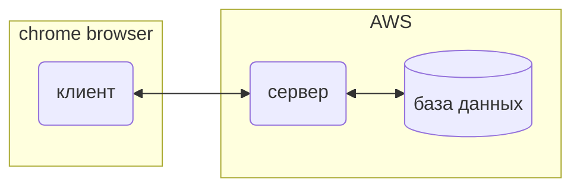

# OktoDoc
OktoDoc это расширение для браузера которое показывает качество медицинской информации на веб-сайте 
(здесь использую термин ресурс, информационный ресурс),
посещённом пользователем. Пользователь находясь на сайте может нажать на значок OktoDoc в браузере, и 
Появится небольшое окно(pop-up окно), где очень кратко отражена полезность ресурса, стоит ли доверять
ему и совет на релевантный ресурс.

### Общая структура проекта OktoDoc
OktoDoc это клиент-северное приложение состоящее из 3-х частей:
- тонкий клиент (Chrome extention);
- сервер (сервер на Django, расположен на AWS);
- база данных (БД) (MySQL на RDS AWS). 

Клиент представляет собой программу, браузерное расширение, в основном написанную на JS.
Функционал клиента — это основные элементы UI, код взаимодействия с браузером, 
 код запросов на сервер и часть логики  login/logout. 
(Мног  event-driven программирования, куча promise-ов и Chrome api)

Сервер написан в Django framework-ке (написан на python). Сервер развернут и работает в
Инфраструктуре AWS. Расположен на домене [oktoserver.com](https://oktoserver.com).

База данных (БД) также расположена в инфраструктуре AWS с помощью сервиса реляционных 
баз данных RDS AWS. MySQL система используется в качестве СУБД.

### OktoDoc это клиент—серверное приложение
Согласно описанной выше структуре принцип работы OktoDoc следующий:
1. Пользователь посещяет сайт медицинской тематики.
2. Нажимает на иконку OktoDoc в панеле браузера (в идеале и без нажатия, просто при посещении сайта).
3. Клиент (код клиента, browser extention) отправляет url текущей активной вкладке браузера на сервер.
4. Сервер обрабатывает полученный url и формирует запрсы в базу данных чтобу узнать информацию об этом сайте (странице). 
5. Из базы данных приходит ответ об рассматриваемом сайте, о его рейтинге, надежности и т.д. (или об остутствии данных о нем).
6. На основе полученных данных OktoDoc сервер формирует ответ пользователъ в виде html блоков (маленькие html странички с инфомацией о ресурсе).
7. Сформированные информационные блоки (html блоки с информацией об интернет ресурсе) отправляются на клиент.
8. Клиент отрисовывает эти блоки в всплывающем окне (pop-up form) и пользователь видет информацию о посещенном сайте в небольшом всплывающем окне, 
в углу браузера.

### OktoDoc это 4 информационных блока
С точки зрния используемых данных и с точки зрения взаимодействия с пользователем можно выделить 4 информационных блока.
Взаимодействие сервера с расширением (с клиентом) также разделено на 4 блока. Pop-up окно разделено тоже на 4 блока.
 1. Credential block, блог проверки прав доступа, login/logout пользователя, обмен токинами и тд. 
На pop-up окне этот блок представлен кнопками логина и мета данными в коде страницы с необходимыми токинами авторизации.
 2. Блок информации о ресурсе, о посещяемом вебсайте. это информация извлеченная из базы данных об конкретном url. 
На pop-up окне этот блок отрисовывает оценки, теги и другую информацию о сайте.
 3. Блок опроса пользователя о посещаемом ресурсе. Это запрос пользователю оценить посещяемую страницу.
Здесь база данных пополняется новой информацией. На pop-up окне это форма со скроллерами для оценивыния ресурса
(блок также может быть пустой если от того пользователя оценка уже есть или сессия анонимная и пользователь не известен)
 4. Блок совета о схожих информационных ресурсах. Анализ рассматриваемого ресурса и на основе тегов и оценок поиск
другого реллевантного ресурса, который может быть интересен пользователю.

